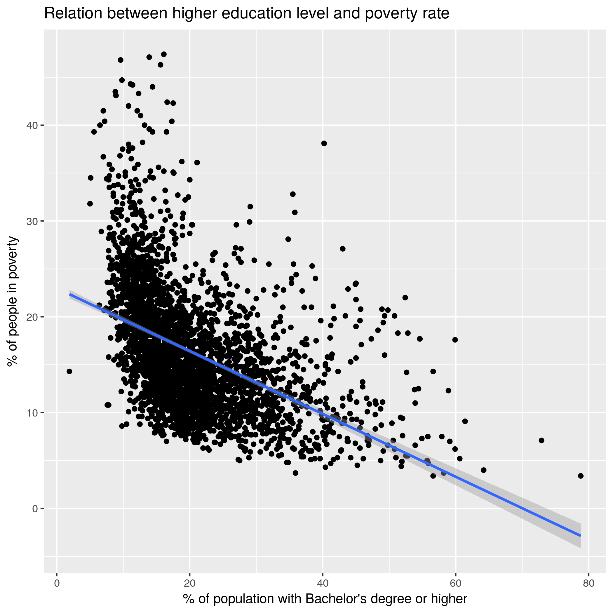

# Abstract
It is a common belief that the the path out of poverty is education. The reason being that education opens the path to jobs with higher earnings. It is these higher income outlook and to an extent, avoiding aimless spending which allows one to climb out of poverty. Politicians even present on their platforms ways to expand education as a means to reduce poverty.

There have already been studies that looked into the relationship between education and poverty. However, for this rudimentary analysis, we take a very simplified look into the relationship and find consistency in the hypothesis.

# Analysis
The analysis takes data from the US department of agriculture[1] and extracts for each county the percent of poeple in poverty and the percent of people with a Bacherlor's degree or higher. These will serve as measures for poverty and education respectively. Each pair of observations can be represented in a scatter plot where each point is a county.

The fit itself is poor, an innacurate model of the data and serves only to show a trend. The particular trend is that lower poverty rates follow higher education. 

# Sources
* [1] County-level Data Sets . United States Department of Agriculture: Economic Research Service. Accessed 2017. URL: https://www.ers.usda.gov/data-products/county-level-data-sets/
